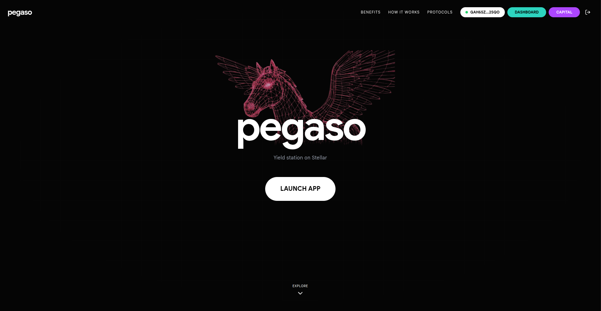
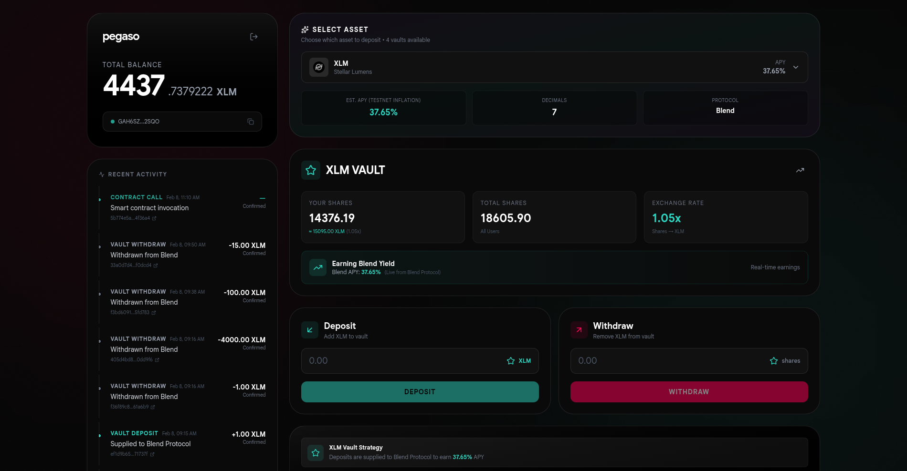
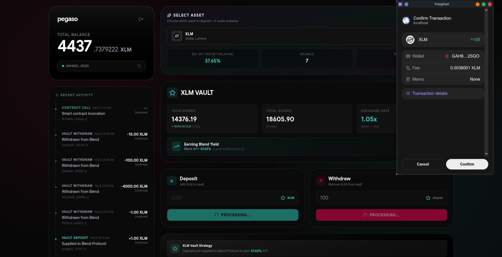
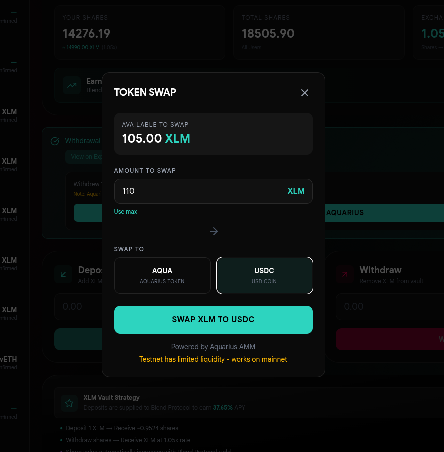
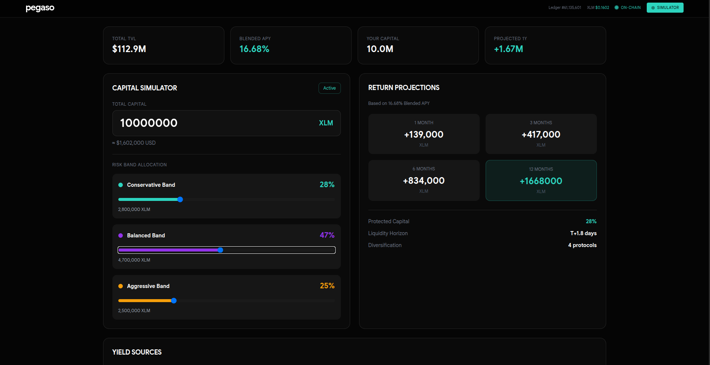
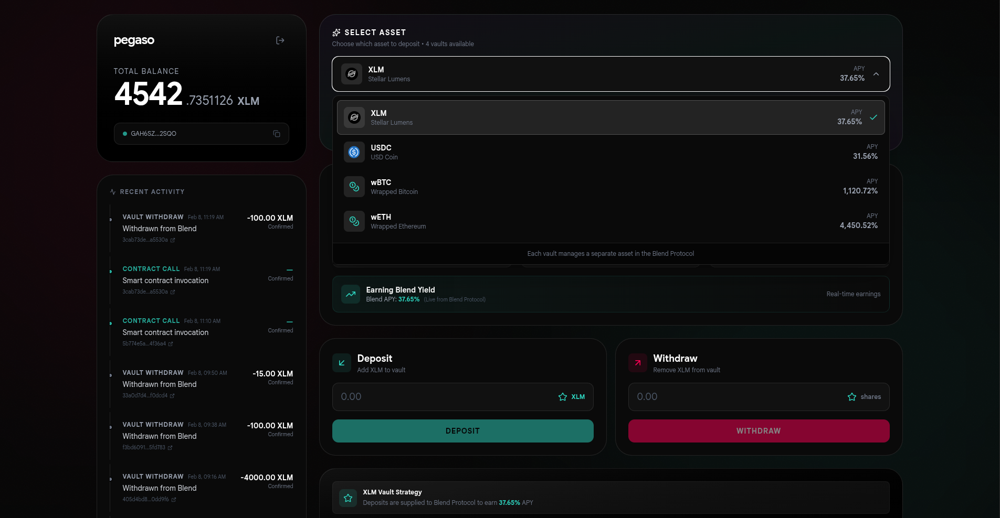

# pesago

Multi-asset yield vault on Stellar. Users deposit XLM/USDC/wBTC/wETH; vault supplies to Blend Protocol  users earn yield and withdraw. Optional post-withdraw swap via Aquarius AMM. Capital Strategy page: UI-only risk-band simulator for institutional positioning.

---

## Screenshots

| | | |
|:---:|:---:|:---:|
|  |  |  |
| **Landing page** —  | **Dashboard** — Balance, vault deposit/withdraw, activity log, Capital Strategy CTA. | **Transaction** — Success state with Explorer link (deposit/withdraw). |
|  |  |  |
| **Aquarius** — Post-withdraw swap modal (XLM → AQUA/USDC). | **Capital Strategy** — Risk bands, simulator sliders, return projections, wallet & activity. | **Asset select** — Switch vault (XLM, USDC, wBTC, wETH). |

---

## Architecture

```
User (Freighter wallet) → Frontend (React) → Soroban RPC / Horizon
                         ↓
              vaultContract.ts (build/sign/submit)
                         ↓
              pegaso Vault (Soroban) → Blend Pool (supply/withdraw collateral) -> Aquarius swap option
```

- **One vault contract per asset.** Frontend switches contract ID via `setActiveContractId(vaultAddress)`; config in `FE/src/config/vaults.ts`.
- **Wallet:** Freighter only. `@stellar/freighter-api`: `isConnected`, `getAddress`, `setAllowed`, `signTransaction`. Connection persisted in `localStorage` key `pegaso_wallet_connected`.

---

## Repo layout

```
vault/
├── FE/                          # Frontend (Vite + React + TypeScript)
│   ├── src/
│   │   ├── App.tsx              # Routes: /, /dashboard, /capital
│   │   ├── config/vaults.ts     # Per-asset vault config (token, vault, pool, APY)
│   │   ├── context/WalletContext.tsx   # Wallet state, Horizon account, balances
│   │   ├── pages/
│   │   │   ├── Landing.tsx      # Connect wallet, CTA to dashboard
│   │   │   ├── Dashboard.tsx    # Balance, vault UI, activity, Capital Strategy CTA
│   │   │   └── TreasuryStrategy.tsx   # Capital Strategy: risk bands, simulator, wallet, activity
│   │   ├── components/
│   │   │   ├── VaultInterface.tsx      # Deposit/withdraw, asset selector, swap CTA
│   │   │   ├── AssetSelector.tsx       # Switch vault (XLM/USDC/wBTC/wETH)
│   │   │   └── SwapModal.tsx           # Aquarius swap (XLM → AQUA/USDC)
│   │   └── utils/
│   │       ├── stellar.ts       # NETWORK_PASSPHRASE, Horizon, Soroban RPC (testnet)
│   │       ├── vaultContract.ts # Contract calls: init, deposit, withdraw, getBalance, getTotalShares, setActiveContractId
│   │       └── aquariusSwap.ts  # Aquarius find-path + swap_chained (testnet)
│   ├── .env.local               # VITE_VAULT_CONTRACT_ID (default vault, e.g. XLM)
│   └── vercel.json              # SPA rewrites for /dashboard, /capital
│
├── Vault/contracts/pegaso-vault/
│   └── src/lib.rs               # PegasoVault: init, deposit, withdraw, balance, total_shares, get_asset, get_pool
│
├── vault_addresses.env          # Optional: USDC_VAULT, wBTC_VAULT, wETH_VAULT
└── DEPLOYMENT.md                # Build/deploy/init steps
```

---

## Contract (pegaso-vault)

| Function        | Role |
|----------------|------|
| `init(pool, asset)` | Set Blend pool + token address; init balances map and total_shares. |
| `deposit(user, amount)` | User auth → transfer user→vault → authorize vault→pool → Blend `submit(SUPPLY_COLLATERAL)` → credit shares (amount × 10^7 / b_rate). |
| `withdraw(user, amount)` | User auth → redeem `amount` shares → authorize b_token transfer → Blend `submit(WITHDRAW_COLLATERAL)` → send underlying to user. |
| `balance(user)` | User’s share balance. |
| `total_shares()` | Total vault shares. |
| `get_asset()` / `get_pool()` | Stored asset and pool addresses. |

- **Shares:** `b_rate` fixed at 10_500_000 (1.05) for MVP; share = (amount × 10^7) / b_rate.
- **Blend:** `blend_contract_sdk::pool::Client`; request types `SUPPLY_COLLATERAL` (2), `WITHDRAW_COLLATERAL` (3). Contract authorizes via `authorize_as_current_contract` for token/pool transfers.

---

## Frontend – core

| File / layer    | Role |
|-----------------|------|
| `stellar.ts`    | Testnet: `NETWORK_PASSPHRASE`, `horizonServer`, `sorobanServer`. |
| `vaults.ts`     | VaultConfig[]: id, symbol, tokenAddress, vaultAddress, poolAddress, estimatedAPY, decimals. `getActiveVault()`, `getAvailableVaults()`. |
| `vaultContract.ts` | `setActiveContractId(id)`; `deposit(user, amount)`, `withdraw(user, shares)`; `getBalance(user)`, `getTotalShares()`; `initVault(...)`. Build → simulate → prepare → Freighter `signTransaction` → send → wait. |
| `WalletContext.tsx` | Freighter connection, Horizon account load, balance/subentries/payments; persistence; `refreshAddress`, `disconnect`. |
| `VaultInterface.tsx` | Uses `vaultContract` + `vaults`; asset selector calls `setActiveContractId`; deposit/withdraw forms; stores vault tx in `localStorage` (`vault_tx_history`). |
| `TreasuryStrategy.tsx` | Capital Strategy: capital input, risk-band sliders (simulator), return projections, yield sources table, wallet snippet, your activity. Real data: CoinGecko XLM, Horizon ledger; Blend-style APY from hook. |

---

## Tech

| Stack | Choice |
|-------|--------|
| Chain | Stellar (Soroban), testnet by default. |
| Wallet | Freighter (`@stellar/freighter-api`). |
| SDK | `@stellar/stellar-sdk` (Contract, TransactionBuilder, Soroban RPC, Horizon). |
| Contract | Rust, `soroban-sdk`, `blend-contract-sdk`. |
| Frontend | React 18, Vite, TypeScript, Tailwind, Framer Motion (landing/dashboard). |

---

## Run

```bash
# Frontend
cd FE && cp .env.example .env.local   # set VITE_VAULT_CONTRACT_ID if needed
npm i && npm run dev

# Contract (build only)
cd Vault && cargo build -p pegaso-vault --target wasm32-unknown-unknown --release
```

Deploy and init: see `DEPLOYMENT.md`.

---

## Config

- **FE:** `FE/.env.local`: `VITE_VAULT_CONTRACT_ID` (default vault contract ID).
- **Vaults:** `FE/src/config/vaults.ts`: per-asset `vaultAddress`, `tokenAddress`, `poolAddress`, `estimatedAPY`. Ensure deployed contract IDs match.

---

## Deployed contracts (testnet) and key addresses used

Contracts the app uses. Source: `FE/src/config/vaults.ts`, `FE/src/utils/aquariusSwap.ts`.

| Role | Contract ID |
|------|-------------|
| **Pegaso Vault (XLM)** | `CB253GUKVRSRD47JFA2G4JBKNEEVTX7TMM6L6WCWBXVDAE2DYSUNCLSZ` |
| **Pegaso Vault (USDC)** | `CCK2S3L7IFNHQ6X4TIBNT6COSJ2D2H7M3XGCWW4N43J4U2KBZ26ZNJTB` |
| **Pegaso Vault (wBTC)** | `CCKY72QMUFY2HR3DVSQJTB7NXQZJAPAEQOLUTYBUYGL2MJ2AP6OFGYUZ` |
| **Pegaso Vault (wETH)** | `CAS4LDAOALXHWD3E5XQSFTKCNAC6OEVPBVDPWIBGDARSW2YCOTRIO5IW` |
| **Blend pool** (shared by all vaults) | `CCEBVDYM32YNYCVNRXQKDFFPISJJCV557CDZEIRBEE4NCV4KHPQ44HGF` |
| **Aquarius router** (swap) | `CBCFTQSPDBAIZ6R6PJQKSQWKNKWH2QIV3I4J72SHWBIK3ADRRAM5A6GD` |

Token contracts (vaults wrap these): 
XLM native `CDLZFC3SYJYDZT7K67VZ75HPJVIEUVNIXF47ZG2FB2RMQQVU2HHGCYSC`, 
USDC `CAQCFVLOBK5GIULPNZRGATJJMIZL5BSP7X5YJVMGCPTUEPFM4AVSRCJU`, 
wBTC `CAP5AMC2OHNVREO66DFIN6DHJMPOBAJ2KCDDIMFBR7WWJH5RZBFM3UEI`, 
wETH `CAZAQB3D7KSLSNOSQKYD2V4JP5V2Y3B4RDJZRLBFCCIXDCTE3WHSY3UE`.

---

## Future work 

**Aquarius**
- [ ] Mainnet swap integration (testnet has limited paths/liquidity).
- [ ] LP positions: deposit vault yield or idle capital into Aquarius pools; route “Aggressive” band to AMM.
- [ ] Route post-withdraw flows (e.g. XLM → AQUA/USDC) via Aquarius in-app.

**Defindex**
- [ ] Integrate Defindex Conservative vault for “Conservative” band (capital preservation).
- [ ] Integrate Defindex Balanced for “Balanced” band; source live APY/TVL from Defindex.
- [ ] Single UX: user picks risk band → backend allocates across Blend + Defindex (and later Aquarius LPs).

**Capital Strategy (tranches)**
- [ ] Deploy tranche allocator contract: user deposits once → contract splits across risk bands.
- [ ] Enforce capital priority (Senior → Mezzanine → Junior) and rebalancing rules on-chain.
- [ ] “Execute Strategy” triggers real allocation; unified shares representing tranched exposure.

**Stellar DeFi expansion**
- [ ] Oracles / price feeds for NAV and risk metrics.
- [ ] More protocols: additional lending markets, structured products, or Stellar-native yield sources as they launch.
- [ ] Cross-protocol strategies (e.g. Blend supply + Defindex + Aquarius LPs in one product).

**Institutional / ops**
- [ ] Reporting: APY attribution, PnL, export (e.g. PDF/CSV).
- [ ] Governance / multi-sig for vault or strategy parameters.
- [ ] Audit trail and compliance-friendly views for anchors and funds.
